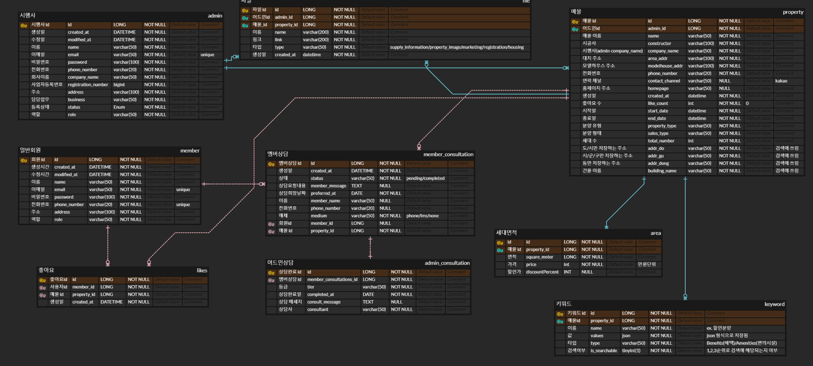

# 🏠파이널 프로젝트 미분양 매물 해결 플랫폼

## 프로젝트 기간
- 2024.07.18 ~ 2024.09.20 
- 기획 기간: 2024.07.18 ~ 2024.8.09
- 개발 기간: 2024.08.09 ~ 2024.9.20

## 👥팀원 구성

■ BE  
|                                      **박지선👑**                                   |                                        **박성찬**                                      |                                **한보름**                              |                                        **이유정**                                          |                                        **길보미**                                          |
|:--------------------------------------------------------------------------------------:|:-------------------------------------------------------------------------------------:|:---------------------------------------------------------------------:|:-----------------------------------------------------------------------------------------:|:-----------------------------------------------------------------------------------------:|
|                    시큐리티(필터링), 나의 상담 내역, 홈 화면, 검색 화면, 미분양 매물 목록        |                        대쉬보드 매물별 집계, 일·주·월간 집계 및 기본값 반환                    |             어드민 상담, 어드민 매물에 대한 상담                          |  시큐리티(회원가입, 로그인), 관심 매물 추가 삭제 및 조회                                               |      배포, 매물 관리 및 매물 상세 페이지 구현                                                   |
|  |  |  |  |  |


■ PM
- 고희진👑
- 강지은
- 김태윤

■ FE 
- 김민수👑
- 김여진 
- 김희용

■ UXUI 
- 전혜지👑
- 김정은
- 김태희
- 권선
- 정윤아


## 배포 아키텍쳐


## ERD


## 🔧기술 스택 및 도구
- Java 17
- Spring boot
- MySQL
- JPA
- Redis
- Spring Batch
- GitRegistry
- AWS
- Docker
- Grafana
- Prometheus


## 📜API 명세서 


## 💻결과물
- [구현 사이트](https://final-project-eta-silk.vercel.app/)
- [스웨거](https://entj.site/swagger-ui/index.html)


## 🖥️기능 구현
- 어드민 상담: 상담사 등록에 분산락 적용
- 어드민 매물에 대한 상담: 오늘 기준으로 분양 중 분양 후를 보여주는 사이드바에 캐시 기능 적용, 정합성을 위해 매일 정각에 캐시 삭제 스케줄링 적용, 상담 내역 리스트 필터링
- 유저 관심매물: Redis 캐시에 좋아요 상태를 먼저 저장 후, batch를 이용해 일정한 시간에 따라 비동기적으로 데이터베이스에 반영
- 미분양 매물 : 필터별로 원하는 매물을 검색할 수 있도록 구현.

## 🗂️패키지 구조
```bash
src/
├── main
│   ├── generated
│   │   └── subscribers
│   │       └── clearbunyang
│   │           ├── domain
│   │           │   ├── consultation
│   │           │   │   └── entity
│   │           │   │       ├── QAdminConsultation.java
│   │           │   │       └── QMemberConsultation.java
│   │           │   ├── file
│   │           │   │   └── entity
│   │           │   │       └── QFile.java
│   │           │   ├── likes
│   │           │   │   └── entity
│   │           │   │       └── QLikes.java
│   │           │   ├── property
│   │           │   │   └── entity
│   │           │   │       ├── QArea.java
│   │           │   │       ├── QKeyword.java
│   │           │   │       └── QProperty.java
│   │           │   └── user
│   │           │       └── entity
│   │           │           ├── QAdmin.java
│   │           │           └── QMember.java
│   │           └── global
│   │               └── entity
│   │                   └── QBaseEntity.java
│   ├── java
│   │   └── subscribers
│   │       └── clearbunyang
│   │           ├── ClearBunyangApplication.java
│   │           ├── domain
│   │           │   ├── auth
│   │           │   │   ├── controller
│   │           │   │   │   ├── AuthController.java
│   │           │   │   │   ├── EmailController.java
│   │           │   │   │   ├── SmsController.java
│   │           │   │   │   └── UserInfoController.java
│   │           │   │   ├── dto
│   │           │   │   │   ├── request
│   │           │   │   │   │   ├── AdminSignUpRequest.java
│   │           │   │   │   │   ├── EmailVerificationCodeRequest.java
│   │           │   │   │   │   ├── EmailVerificationRequest.java
│   │           │   │   │   │   ├── LoginRequest.java
│   │           │   │   │   │   ├── MemberSignUpRequest.java
│   │           │   │   │   │   ├── SmsCertificationCodeRequest.java
│   │           │   │   │   │   └── SmsCertificationRequest.java
│   │           │   │   │   └── response
│   │           │   │   │       ├── LoginResponse.java
│   │           │   │   │       └── UserInfoResponse.java
│   │           │   │   ├── entity
│   │           │   │   │   ├── Admin.java
│   │           │   │   │   ├── Member.java
│   │           │   │   │   └── enums
│   │           │   │   │       ├── AdminState.java
│   │           │   │   │       └── UserRole.java
│   │           │   │   ├── repository
│   │           │   │   │   ├── AdminRepository.java
│   │           │   │   │   └── MemberRepository.java
│   │           │   │   └── service
│   │           │   │       ├── AuthEmailService.java
│   │           │   │       ├── AuthService.java
│   │           │   │       ├── AuthSmsService.java
│   │           │   │       ├── SendEmailService.java
│   │           │   │       ├── SendSmsDao.java
│   │           │   │       └── SendSmsService.java
│   │           │   ├── consultation
│   │           │   │   ├── controller
│   │           │   │   │   ├── AdminConsultationController.java
│   │           │   │   │   ├── AdminPropertyConsultationController.java
│   │           │   │   │   └── MemberConsultationController.java
│   │           │   │   ├── dto
│   │           │   │   │   ├── adminConsultation
│   │           │   │   │   │   ├── request
│   │           │   │   │   │   │   └── ConsultRequest.java
│   │           │   │   │   │   └── response
│   │           │   │   │   │       ├── AdminConsultResponse.java
│   │           │   │   │   │       ├── ConsultCompletedResponse.java
│   │           │   │   │   │       ├── ConsultPendingResponse.java
│   │           │   │   │   │       ├── ConsultantListResponse.java
│   │           │   │   │   │       └── ConsultantResponse.java
│   │           │   │   │   ├── adminPropertyConsultation
│   │           │   │   │   │   ├── request
│   │           │   │   │   │   │   └── NewCustomerAdditionRequest.java
│   │           │   │   │   │   └── response
│   │           │   │   │   │       ├── ConsultCompletedListResponse.java
│   │           │   │   │   │       ├── ConsultCompletedSummaryResponse.java
│   │           │   │   │   │       ├── ConsultPendingListResponse.java
│   │           │   │   │   │       ├── ConsultPendingSummaryResponse.java
│   │           │   │   │   │       ├── SideBarCompletedResponse.java
│   │           │   │   │   │       ├── SideBarListResponse.java
│   │           │   │   │   │       ├── SideBarPendingResponse.java
│   │           │   │   │   │       └── SideBarSelectedPropertyResponse.java
│   │           │   │   │   └── memberConsultations
│   │           │   │   │       ├── ConsultationResponse.java
│   │           │   │   │       └── MyConsultationsResponse.java
│   │           │   │   ├── entity
│   │           │   │   │   ├── AdminConsultation.java
│   │           │   │   │   ├── MemberConsultation.java
│   │           │   │   │   └── enums
│   │           │   │   │       ├── Medium.java
│   │           │   │   │       ├── Status.java
│   │           │   │   │       └── Tier.java
│   │           │   │   ├── exception
│   │           │   │   │   ├── ConsultantException.java
│   │           │   │   │   └── DistributedLockException.java
│   │           │   │   ├── repository
│   │           │   │   │   ├── AdminConsultationRepository.java
│   │           │   │   │   └── MemberConsultationRepository.java
│   │           │   │   └── service
│   │           │   │       ├── AdminConsultationService.java
│   │           │   │       ├── AdminPropertyConsultationService.java
│   │           │   │       └── MemberConsultationService.java
│   │           │   ├── dashBoard
│   │           │   │   ├── controller
│   │           │   │   │   └── AdminDashboardController.java
│   │           │   │   ├── dto
│   │           │   │   │   ├── ConsultationDateStatsDTO.java
│   │           │   │   │   ├── PropertyGraphRequirementsDTO.java
│   │           │   │   │   ├── PropertyInquiryDetailsDTO.java
│   │           │   │   │   ├── PropertyInquiryStatusDTO.java
│   │           │   │   │   ├── PropertySelectDTO.java
│   │           │   │   │   ├── YearMonthDTO.java
│   │           │   │   │   ├── YearMonthDayDTO.java
│   │           │   │   │   ├── YearWeekDTO.java
│   │           │   │   │   └── response
│   │           │   │   │       ├── CardComponentResponse.java
│   │           │   │   │       ├── CardCountDescResponse.java
│   │           │   │   │       ├── CardTodayStatusResponse.java
│   │           │   │   │       ├── CardWeekProgressResponse.java
│   │           │   │   │       ├── DropdownSelectsResponse.java
│   │           │   │   │       ├── GraphRequirementsResponse.java
│   │           │   │   │       ├── PropertyInquiryDetailsResponse.java
│   │           │   │   │       ├── PropertyInquiryStatusResponse.java
│   │           │   │   │       └── PropertySelectResponse.java
│   │           │   │   ├── entity
│   │           │   │   │   └── enums
│   │           │   │   │       ├── GraphInterval.java
│   │           │   │   │       └── Phase.java
│   │           │   │   ├── repository
│   │           │   │   │   ├── DashboardRepository.java
│   │           │   │   │   └── DashboardRepositoryImpl.java
│   │           │   │   └── service
│   │           │   │       └── AdminDashboardService.java
│   │           │   ├── likes
│   │           │   │   ├── controller
│   │           │   │   │   └── LikesController.java
│   │           │   │   ├── dto
│   │           │   │   │   └── response
│   │           │   │   │       ├── LikesPageResponse.java
│   │           │   │   │       └── LikesPropertyResponse.java
│   │           │   │   ├── entity
│   │           │   │   │   └── Likes.java
│   │           │   │   ├── repository
│   │           │   │   │   └── LikesRepository.java
│   │           │   │   └── service
│   │           │   │       └── LikesService.java
│   │           │   └── property
│   │           │       ├── controller
│   │           │       │   ├── AdminPropertyController.java
│   │           │       │   ├── CommonPropertyController.java
│   │           │       │   ├── HomeController.java
│   │           │       │   └── SearchController.java
│   │           │       ├── dto
│   │           │       │   ├── PropertyDateDto.java
│   │           │       │   ├── request
│   │           │       │   │   ├── AreaRequest.java
│   │           │       │   │   ├── KeywordRequest.java
│   │           │       │   │   ├── MemberConsultationRequest.java
│   │           │       │   │   ├── PropertySaveRequest.java
│   │           │       │   │   └── PropertyUpdateRequest.java
│   │           │       │   └── response
│   │           │       │       ├── AreaResponse.java
│   │           │       │       ├── HomeResponse.java
│   │           │       │       ├── KeywordResponse.java
│   │           │       │       ├── MyPropertyCardResponse.java
│   │           │       │       ├── MyPropertyTableResponse.java
│   │           │       │       ├── PropertyDetailsResponse.java
│   │           │       │       ├── PropertySummaryResponse.java
│   │           │       │       └── SearchResponse.java
│   │           │       ├── entity
│   │           │       │   ├── Area.java
│   │           │       │   ├── Keyword.java
│   │           │       │   ├── Property.java
│   │           │       │   └── enums
│   │           │       │       ├── KeywordName.java
│   │           │       │       ├── KeywordType.java
│   │           │       │       ├── PropertyType.java
│   │           │       │       └── SalesType.java
│   │           │       ├── exception
│   │           │       │   └── JsonConversionException.java
│   │           │       ├── repository
│   │           │       │   ├── AreaRepository.java
│   │           │       │   ├── KeywordRepository.java
│   │           │       │   └── PropertyRepository.java
│   │           │       └── service
│   │           │           ├── AreaService.java
│   │           │           ├── HomeService.java
│   │           │           ├── KeywordService.java
│   │           │           ├── PropertyService.java
│   │           │           └── SearchService.java
│   │           └── global
│   │               ├── RedissonLock
│   │               │   ├── DistributedLock.java
│   │               │   └── DistributedLockAop.java
│   │               ├── api
│   │               │   ├── Response.java
│   │               │   └── Result.java
│   │               ├── cache
│   │               │   ├── CacheService.java
│   │               │   └── RedissonCacheServiceImpl.java
│   │               ├── config
│   │               │   ├── AsyncConfig.java
│   │               │   ├── AsyncDecorator.java
│   │               │   ├── AsyncHandler.java
│   │               │   ├── BatchConfig.java
│   │               │   ├── JpaAuditingConfig.java
│   │               │   ├── ObjectMapperConfig.java
│   │               │   ├── RedisConfig.java
│   │               │   ├── S3Config.java
│   │               │   ├── SecurityConfig.java
│   │               │   └── SwaggerConfig.java
│   │               ├── dto
│   │               │   └── PagedDto.java
│   │               ├── entity
│   │               │   └── BaseEntity.java
│   │               ├── exception
│   │               │   ├── CustomException.java
│   │               │   ├── EntityNotFoundException.java
│   │               │   ├── InvalidValueException.java
│   │               │   ├── errorCode
│   │               │   │   └── ErrorCode.java
│   │               │   └── handler
│   │               │       └── GlobalExceptionHandler.java
│   │               ├── file
│   │               │   ├── controller
│   │               │   │   └── FileController.java
│   │               │   ├── dto
│   │               │   │   ├── FileRequestDTO.java
│   │               │   │   ├── FileResponseDTO.java
│   │               │   │   ├── PresignedUrlRequestDTO.java
│   │               │   │   └── UploadFileDTO.java
│   │               │   ├── entity
│   │               │   │   ├── File.java
│   │               │   │   └── enums
│   │               │   │       └── FileType.java
│   │               │   ├── repository
│   │               │   │   └── FileRepository.java
│   │               │   └── service
│   │               │       └── FileService.java
│   │               ├── scheduler
│   │               │   └── Scheduler.java
│   │               ├── security
│   │               │   ├── details
│   │               │   │   ├── CustomUserDetails.java
│   │               │   │   └── CustomUserDetailsService.java
│   │               │   ├── filter
│   │               │   │   └── AuthenticationFilter.java
│   │               │   ├── token
│   │               │   │   ├── JwtTokenProcessor.java
│   │               │   │   ├── JwtTokenProvider.java
│   │               │   │   ├── JwtTokenService.java
│   │               │   │   ├── JwtTokenTime.java
│   │               │   │   └── JwtTokenType.java
│   │               │   └── util
│   │               │       └── CookieUtil.java
│   │               ├── service
│   │               │   └── DBInit.java
│   │               └── validation
│   │                   ├── EmailValidation.java
│   │                   ├── EmailValidator.java
│   │                   ├── NumericValidation.java
│   │                   ├── NumericValidator.java
│   │                   ├── PasswordValidation.java
│   │                   └── PasswordValidator.java
│   └── resources
│       ├── application.yaml
│       ├── application.yaml.file
│       └── liquibase
│           └── migrations
└── test
    └── java
        └── subscribers
            └── clearbunyang
                ├── ClearBunyangApplicationTests.java
                ├── domain
                │   ├── auth
                │   │   └── service
                │   │       ├── AuthSendEmailServiceTest.java
                │   │       ├── AuthServiceTest.java
                │   │       └── AuthSmsServiceTest.java
                │   ├── consultation
                │   │   ├── scheduler
                │   │   │   └── SchedulerIntegrationTest.java
                │   │   └── service
                │   │       ├── AdminConsultationControllerIntegrationTest.java
                │   │       ├── AdminConsultationServiceTest.java
                │   │       ├── AdminPropertyConsultationServiceTest.java
                │   │       ├── MyConsultationServiceTest.java
                │   │       └── lockTest.js
                │   ├── like
                │   │   └── service
                │   │       ├── LikesRedisServiceTest.java
                │   │       └── LikesServiceTest.java
                │   └── property
                │       ├── controller
                │       │   ├── AdminPropertyControllerIntegrationTest.java
                │       │   ├── AdminPropertyControllerTest.java
                │       │   ├── CommonPropertyControllerIntegrationTest.java
                │       │   └── CommonPropertyControllerTest.java
                │       └── service
                │           ├── HomeServiceTest.java
                │           ├── PropertyServiceIntegrationTest1.java
                │           └── PropertyServiceIntegrationTest2.java
                ├── security
                │   ├── AuthenticationFilterMocking.java
                │   ├── WithMockCustomAdminSecurityContextFactory.java
                │   ├── WithMockCustomMemberSecurityContextFactory.java
                │   └── annotation
                │       ├── WithMockCustomAdmin.java
                │       └── WithMockCustomMember.java
                ├── testdata
                │   ├── AdminConsultationInsert.java
                │   ├── CompletedConsultationInsert.java
                │   ├── MemberConsultationInsert.java
                │   ├── RandomDateGenerator.java
                │   ├── RandomKoreanNameGenerator.java
                │   └── RandomPhoneNumberGenerator.java
                └── testfixtures
                    ├── AdminRegisterFixture.java
                    ├── MemberConsultationRequestDTOFixture.java
                    ├── MemberRegisterFixture.java
                    ├── PropertySaveRequestDTOFixture.java
                    └── PropertyUpdateRequestDTOFixture.java
```