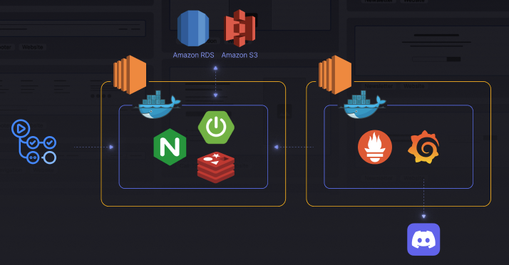
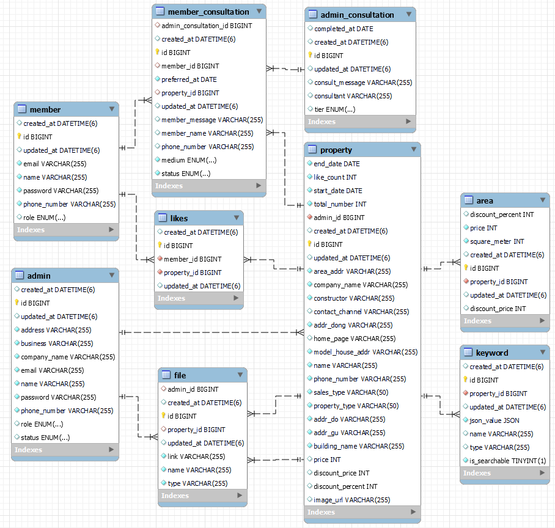
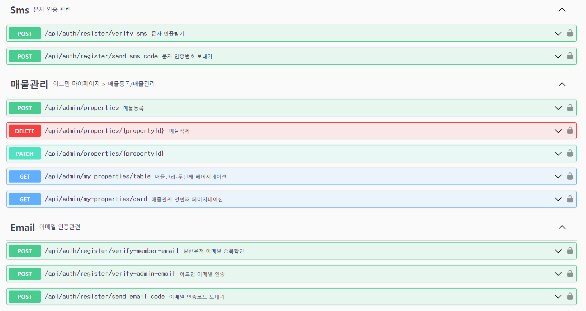
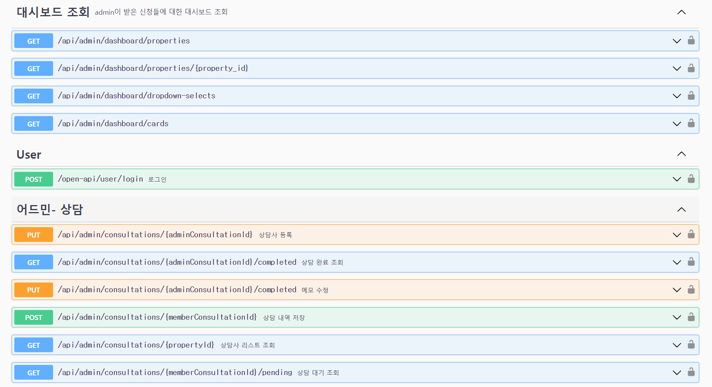
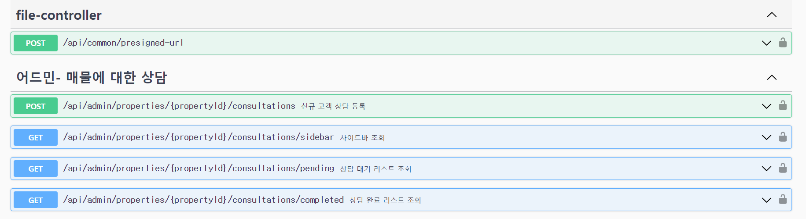

# 🏠파이널 프로젝트 미분양 매물 해결 플랫폼

## 프로젝트 기간
- 2024.07.18 ~ 2024.09.20 
- 기획 기간: 2024.07.18 ~ 2024.8.09
- 개발 기간: 2024.08.09 ~ 2024.9.20

## 👥팀원 구성

■ BE  
|                                      **박지선👑**                                   |                                        **박성찬**                                      |                                **한보름**                              |                                        **이유정**                                          |                                        **길보미**                                          |
|:--------------------------------------------------------------------------------------:|:-------------------------------------------------------------------------------------:|:---------------------------------------------------------------------:|:-----------------------------------------------------------------------------------------:|:-----------------------------------------------------------------------------------------:|
|                    시큐리티(필터링), 나의 상담 내역, 홈 화면, 검색 화면, 미분양 매물 목록        |                        대쉬보드 매물별 집계, 일·주·월간 집계 및 기본값 반환                    |             어드민 상담, 어드민 매물에 대한 상담                          |  시큐리티(회원가입, 로그인), 관심 매물 추가 삭제 및 조회                                               |      배포, 매물 관리 및 매물 상세 페이지 구현                                                   |
|  |  |  |  |  |


■ PM
- 고희진👑
- 강지은
- 김태윤

■ FE 
- 김민수👑
- 김여진 
- 김희용

■ UXUI 
- 전혜지👑
- 김정은
- 김태희
- 권선
- 정윤아


## 배포 아키텍쳐


## ERD


## 🔧기술 스택 및 도구
- Java 17
- Spring boot
- MySQL
- JPA
- Redis
- Spring Batch
- GitRegistry
- AWS
- Docker
- Grafana
- Prometheus


## 📜API 명세서 





## 💻결과물
- [구현 사이트](https://www.clearbunyang.site/)
- [스웨거](https://entj.site/swagger-ui/index.html)


## 🖥️기능 구현
- 어드민 상담: 상담사 등록에 분산락 적용
- 어드민 매물에 대한 상담: 오늘 기준으로 분양 중 분양 후를 보여주는 사이드바에 캐시 기능 적용, 정합성을 위해 매일 정각에 캐시 삭제 스케줄링 적용, 상담 내역 리스트 필터링
- 대쉬보드 : 그래프에서 가로 축 레이블에 해당하는 시, 주, 월, 매물 등의 값이 들어가도록 빈 배열을 생성합니다. 그리고 축의 값들을 키로 해서 집계 쿼리에서 반환된 열과 비교하여 반환 값을 생성합니다.  
- 유저 관심매물: Redis 캐시에 좋아요 상태를 먼저 저장 후, batch를 이용해 일정한 시간에 따라 비동기적으로 데이터베이스에 반영
- 미분양 매물 : 필터별로 원하는 매물을 검색할 수 있도록 구현.

## 🗂️패키지 구조
```bash
src/
├── main
│   ├── generated
│   │   └── subscribers
│   │       └── clearbunyang
│   │           ├── domain
│   │           │   ├── consultation
│   │           │   │   └── entity
│   │           │   ├── file
│   │           │   │   └── entity
│   │           │   ├── likes
│   │           │   │   └── entity
│   │           │   ├── property
│   │           │   │   └── entity
│   │           │   └── user
│   │           │       └── entity
│   │           └── global
│   │               └── entity
│   ├── java
│   │   └── subscribers
│   │       └── clearbunyang
│   │           ├── domain
│   │           │   ├── auth
│   │           │   │   ├── controller
│   │           │   │   ├── dto
│   │           │   │   │   ├── requesta
│   │           │   │   │   └── response
│   │           │   │   ├── entity
│   │           │   │   │   └── enums
│   │           │   │   ├── repository
│   │           │   │   └── service
│   │           │   ├── consultation
│   │           │   │   ├── controller
│   │           │   │   ├── dto
│   │           │   │   │   ├── adminConsultation
│   │           │   │   │   │   ├── request
│   │           │   │   │   │   └── response
│   │           │   │   │   ├── adminPropertyConsultation
│   │           │   │   │   │   ├── request
│   │           │   │   │   │   └── response
│   │           │   │   │   └── memberConsultations
│   │           │   │   ├── entity
│   │           │   │   │   └── enums
│   │           │   │   ├── exception
│   │           │   │   ├── repository
│   │           │   │   └── service
│   │           │   ├── dashBoard
│   │           │   │   ├── controller
│   │           │   │   ├── dto
│   │           │   │   │   └── response
│   │           │   │   ├── entity
│   │           │   │   │   └── enums
│   │           │   │   ├── repository
│   │           │   │   └── service
│   │           │   ├── likes
│   │           │   │   ├── controller
│   │           │   │   ├── dto
│   │           │   │   │   └── response
│   │           │   │   ├── entity
│   │           │   │   ├── repository
│   │           │   │   └── service
│   │           │   └── property
│   │           │       ├── controller
│   │           │       ├── dto
│   │           │       │   ├── request
│   │           │       │   └── response
│   │           │       ├── entity
│   │           │       │   └── enums
│   │           │       ├── exception
│   │           │       ├── repository
│   │           │       └── service
│   │           └── global
│   │               ├── RedissonLock
│   │               ├── api
│   │               ├── cache
│   │               ├── config
│   │               ├── dto
│   │               ├── entity
│   │               ├── exception
│   │               │   ├── errorCode
│   │               │   └── handler
│   │               ├── file
│   │               │   ├── controller
│   │               │   ├── dto
│   │               │   ├── entity
│   │               │   │   └── enums
│   │               │   ├── repository
│   │               │   └── service
│   │               ├── scheduler
│   │               ├── security
│   │               │   ├── details
│   │               │   ├── filter
│   │               │   ├── tokeice
│   │               │   └── util
│   │               ├── service
│   │               └── validation
│   └── resources
│       ├── application.yaml
│       ├── application.yaml.file
│       └── liquibase
│           └── migrations
└── test
    └── java
        └── subscribers
            └── clearbunyang
                ├── ClearBunyangApplicationTests
                ├── domain
                │   ├── auth
                │   │   └── service
                │   │       ├── AuthSendEmailServiceTest
                │   │       ├── AuthServiceTest
                │   │       └── AuthSmsServiceTest
                │   ├── consultation
                │   │   ├── scheduler
                │   │   │   └── SchedulerIntegrationTest
                │   │   └── service
                │   │       ├── AdminConsultationControllerIntegrationTest
                │   │       ├── AdminConsultationServiceTest
                │   │       ├── AdminPropertyConsultationServiceTest
                │   │       ├── MyConsultationServiceTest
                │   │       └── lockTest.js
                │   ├── like
                │   │   └── service
                │   │       ├── LikesRedisServiceTest
                │   │       └── LikesServiceTest
                │   └── property
                │       ├── controller
                │       │   ├── AdminPropertyControllerIntegrationTest
                │       │   ├── AdminPropertyControllerTest
                │       │   ├── CommonPropertyControllerIntegrationTest
                │       │   └── CommonPropertyControllerTest
                │       └── service
                │           ├── HomeServiceTest
                │           ├── PropertyServiceIntegrationTest1
                │           └── PropertyServiceIntegrationTest2
                ├── security
                │   ├── AuthenticationFilterMocking
                │   ├── WithMockCustomAdminSecurityContextFactory
                │   ├── WithMockCustomMemberSecurityContextFactor
                │   └── annotation
                │       ├── WithMockCustomAdmin
                │       └── WithMockCustomMember
                ├── testdata
                │   ├── AdminConsultationInsert
                │   ├── CompletedConsultationInsert
                │   ├── MemberConsultationInsert
                │   ├── RandomDateGenerator
                │   ├── RandomKoreanNameGenerator
                │   └── RandomPhoneNumberGenerator
                └── testfixtures
                    ├── AdminRegisterFixture
                    ├── MemberConsultationRequestDTOFixture
                    ├── MemberRegisterFixture
                    ├── PropertySaveRequestDTOFixture
                    └── PropertyUpdateRequestDTOFixture
```